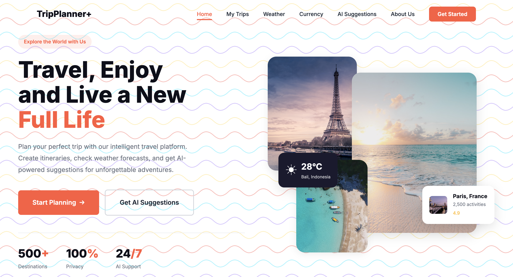
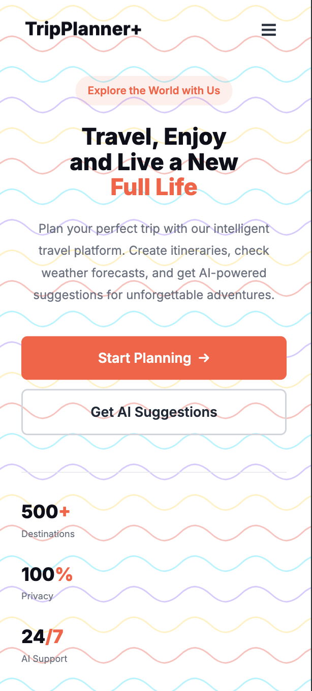
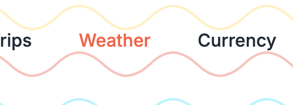
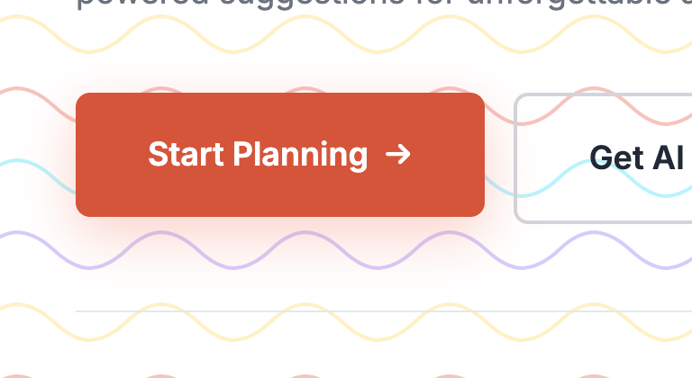
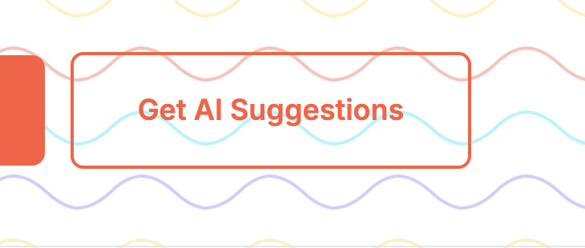

# Examen 1 - Parte 2

> [!IMPORTANT]
> Es imprescindible aprobar la parte 1 para que esta parte 2 sea evaluada.

Haz una página web usando **todas** las buenas prácticas que conozcas que muestre lo siguiente:

Y en versión móvil se debe mostrar así:

---

## 🎨 Guía de estilos

### General
- Fuente: [Inter](https://fonts.google.com/specimen/Inter)
- Colores:

| Nombre sugerido | Código de color |
|-----------------|-----------------|
| primary-color   | `#FF5A3C`       |
| dark-color      | `#0F0F1A`       |
| text-color      | `#1F2937`       |
| white-color     | `#FFFFFF`       |
| light-color     | `#6B7280`       |

---

### Navbar
- Tamaño de los links: `0.95rem`
- Color de los links: `text-color`
- Primer link: `primary-color`
- Color del logo: `dark-color`
- Color del botón "Get Started":
  - Fondo: `primary-color`
  - Texto: `white-color`

- Links hover: `primary-color`
  

---

### Parte principal

#### Izquierda

- *Explore the world with us*:
  - Tamaño: `0.875rem`
  - Color de texto: `primary-color`
  - Color de fondo: `rgba(255, 90, 60, 0.1)`
- Título:
  - Tamaño: `3.5rem`
  - Color oscuro: `dark-color`
  - Color naranja: `primary-color`
  - Negrita: `800`
- Texto *Plan your perfect trip...*:
  - Tamaño: `1.125rem`
  - Color: `light-color`
- Call to action button *Start planning →*:
  - Tamaño: `1.125rem`
  - Color de texto: `white-color`
  - Color de fondo: `primary-color`
  - Hover animado:
    - Se debe mover hacia arriba `2px`.
    - Debe aparecer una sombra con el siguiente código: `0 10px 30px rgba(255, 90, 60, 0.3)`.
  

- Call to accion button *Get AI Suggestions*:
  - Tamaño: `1.125rem`
  - Color de texto: `text-color`
  - Color de borde: `#D1D5DB`
  - Hover animado:
    - Debe cambiar el color del texto y del borde a `primary-color`.

- Linea color `light-color`.
- Estadísticas:
  - Tamaño de los números: `2rem`
  - Negrita de los números: `800`
  - Tamaño de los textos: `0.875rem`
  - Colores de los números: `dark-color` y `primary-color`
  - Colores de los textos: `light-color`

#### Derecha

- Las imágenes tienen sombra: `0 8px 30px rgba(0, 0, 0, 0.12)`
- Las imágenes las encontrarás en los siguientes enlaces:
  - [Playa1](./assets/photo-beach1.png)
  - [Torre Eiffel](./assets/photo-eiffel-tower.png)
  - [Playa2](./assets/photo-beach2.png)
  - [Puente](./assets/photo-bridge.png)
- Cuadrado de la temperatura:
  - Color de texto: `white-color`
  - Color de fondo: `#1A1A2E`
  - Icono: ☀
  - Tamaño de la temperatura: `1.5rem`
  - Negrita de la temperatura: `700`
  - Tamaño de la ubicación: `0.75rem`
  - Opacidad de la ubicación: `0.8`
- Cuadrado *Paris, France ...*:
  - *Paris, France*:
    - Tamaño: `0.95rem`
    - Color: `dark-color`
  - *2,500 activities*:
    - Tamaño: `0.8rem`
    - Color: `light-color`
  - *4.9*:
    - Tamaño: `0.8rem`
    - Color: `#FFB800`
